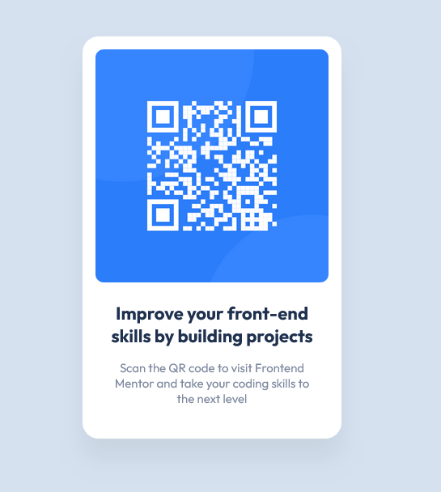

# Frontend Mentor - QR code component solution

This is a solution to the [QR code component challenge on Frontend Mentor](https://www.frontendmentor.io/challenges/qr-code-component-iux_sIO_H). Frontend Mentor challenges help you improve your coding skills by building realistic projects. 

## Table of contents

- [Overview](#overview)
  - [Screenshot](#screenshot)
  - [Links](#links)
- [My process](#my-process)
  - [Built with](#built-with)
  - [What I learned](#what-i-learned)
  - [Useful resources](#useful-resources)
- [Author](#author)

## Overview

### Screenshot

### Links

- Solution URL: [Add solution URL here](https://github.com/kieran-lockyer/qr-code-component)
- Live Site URL: [Add live site URL here](https://qr-code-component-beta-five.vercel.app/)

## My process
Given that this challenge is very simple, this has been an exercise in learning Figma as a developer.
My process was to navigate the figma application to find useful information like font-family, border-radius and padding sizes etc.
After that it was a straightforward implementation of the designs into html and css.

### Built with

- html
- CSS

### What I learned

Where properties such as font-family are viewable in figma, and how to use keyboard shortcuts to measure distances between elements.

### Useful resources

- [Figma Resources](https://help.figma.com/hc/en-us/articles/360039956974-Measure-distances-between-layers) - Where I found handy Figma shortcuts.

## Author

- Website - [Kieran Lockyer](www.kieranlockyer.com.au)
- Frontend Mentor - [@kieran-lockyer](https://www.frontendmentor.io/profile/kieran-lockyer)
